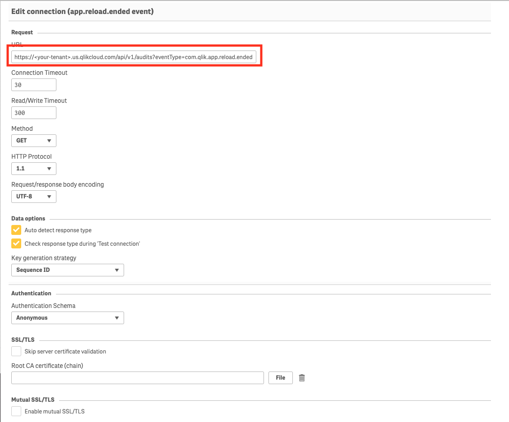
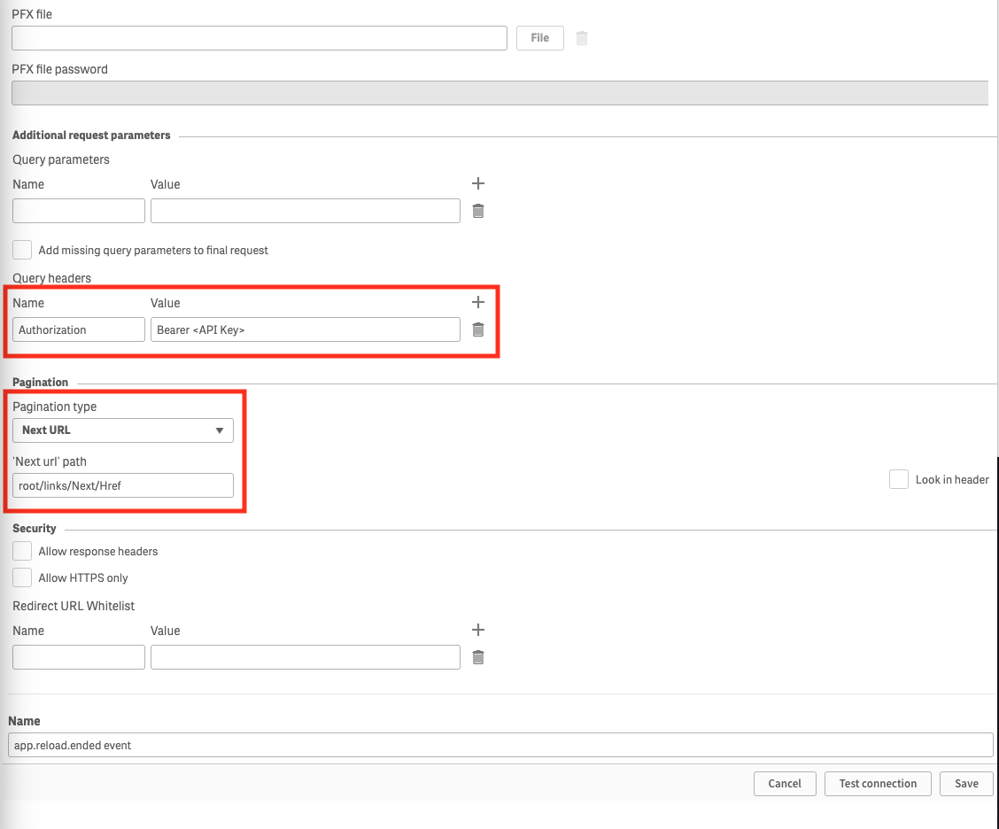

# qlik-event-monitoring
A basic app that mines the events data in Qlik Sense SaaS.

    

## Prerequisites
1. Signup for a Qlik Sense SaaS tenant
2. Create an API Key (refer to https://qlik.dev/tutorials/generate-your-first-api-key for details)

## Setup

1. Login to your Qlik Sense SaaS tenant as a Tenant Admin
2. Create a shared space called `Admin`
3. Upload `Monitoring Events.qvf` to the `Admin` space
4. Create two REST connections in the `Admin` space called:
   - app.reload.ended event
   - app.data.updated event
5. Open the app and select `Load data` from the `Data load editor`

### Create REST connections
Create two REST connections one for each of the eventTypes: com.app.reload.ended and com.app.data.updated. Specify the eventType in the URL. See below for details:

    

    

